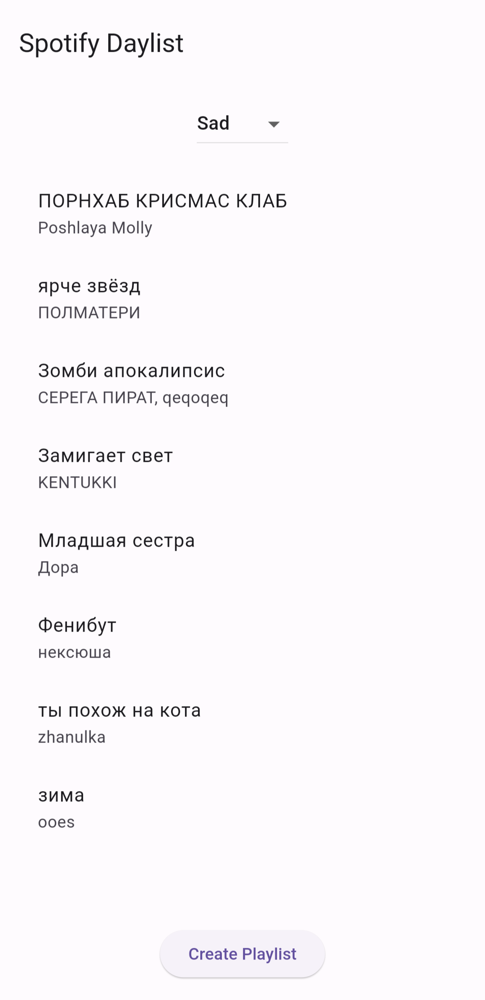

# Moodify

An app for creating music playlists depending on your mood.

## Features

- Create playlists based on the user's mood from Spotify daylist.
- Sorting tracks to suit your mood only.
- Spotify Auth

### TODOS.

- Refactor app design
- Add ability to sort tracks from specified playlist.
- Share playlist to social media's.
